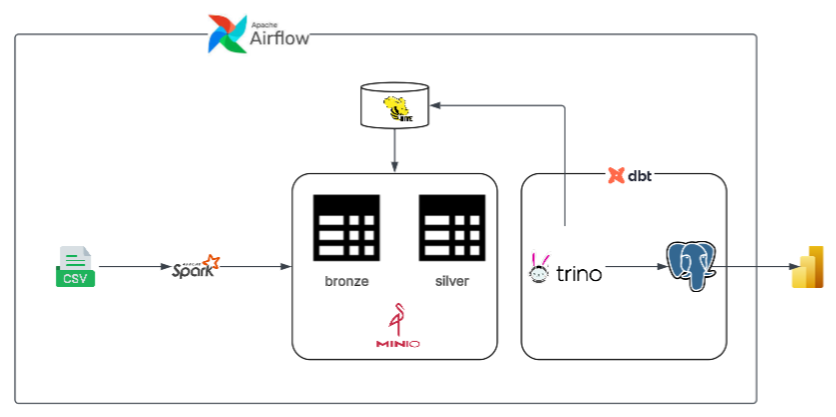
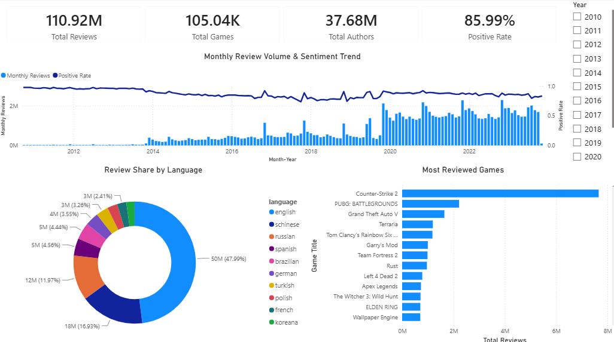
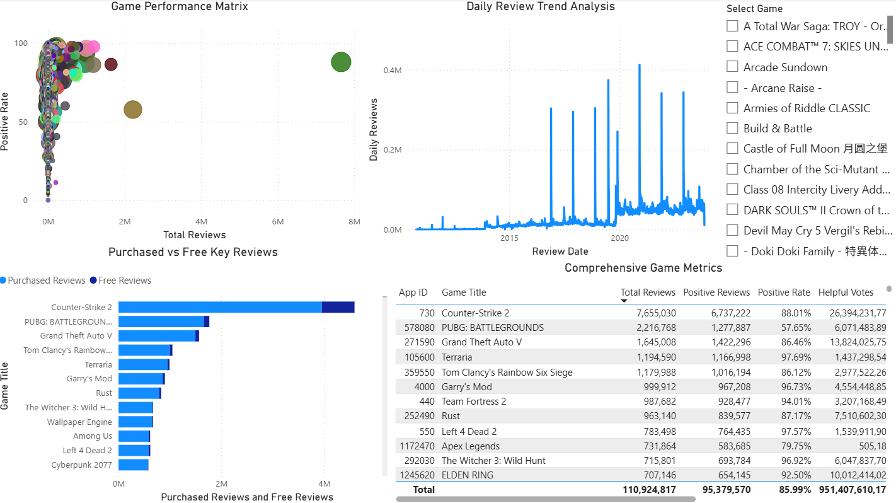
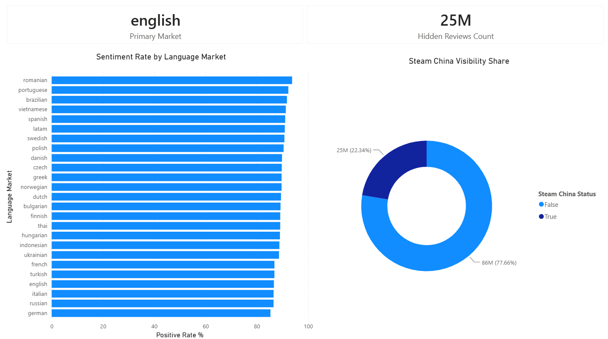

# steam_gaming_analytics

> **Understanding user sentiment and behavior across large-scale digital platforms is essential for product evolution. Driven by a passion for analytics engineering, I built this project to transform millions of raw Steam reviews into structured analytical models, bridging the gap between player feedback and actionable insights.**

---

## Overview

&nbsp;&nbsp;&nbsp;&nbsp;Designed to handle high-volume user feedback datasets, this project establishes a modern analytics pipeline for sentiment and market analysis. Raw tabular review records are cleaned, modeled, and transformed into structured analytical marts, enabling granular exploration into review volume, long-term sentiment trends, language distribution, and game popularity.

---

## Architecture



---

## Data Visualization

### 1. Overview Dashboard

&nbsp;&nbsp;&nbsp;&nbsp;Provides a high-level overview by consolidating key performance indicators, tracking monthly review volume and positive review rate over time, and breaking down engagement distribution across international user languages.



### 2. Product Deep-Dive

&nbsp;&nbsp;&nbsp;&nbsp;Focuses on item-level performance by evaluating review volume against approval percentages, tracking long-term daily review trends, comparing Steam-purchased reviews with reviews received for free, and offering granular metrics for cross-product benchmarking.



### 3. Market & Localization

&nbsp;&nbsp;&nbsp;&nbsp;Evaluates user sentiment consistency across localized language markets while quantifying total hidden review volumes and measuring visibility share within Steam China.



---

## Data Source

&nbsp;&nbsp;&nbsp;&nbsp;Primary data is sourced from the [Steam Reviews Dataset](https://www.kaggle.com/datasets/kieranpoc/steam-reviews) on Kaggle. This comprehensive repository serves as the baseline for the entire pipeline, offering millions of granular historical records that capture player feedback, playtimes, sentiment ratings, purchase status, and regional localization attributes across diverse global markets.

---

## Project Structure

```
steam_gaming_analytics/
├── steam_analytics
│   └── models
│       ├── dim
│       ├── fact
│       ├── mart
│       ├── staging
│       └── schema.yaml
│
├── config
│
├── dags
│   ├── configs
│   │   ├── bronze
│   │   └── silver
│   └── root
│
├── src/main/java/com/steam/
│   ├── bronze
│   ├── silver
│   ├── config
│   └── trino
│
├── plugins
│   ├── generators
│   └── models
│
├── .env
├── .gitignore
├── pom.xml
└── README.md
```